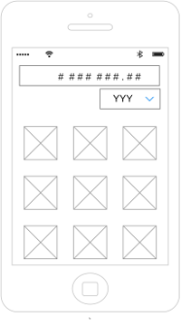

# Developer Coding Challenge

Welcome to the Paytm Labs Developer Challenge! The purpose of this challenge is to give us a better understanding of your coding skills. If you have any questions or need any clarifications for this challenge, please get in touch!

Estimated time: 1hr. 

## Goal:

#### Develop a Currency Conversion App that allows a user to convert any currency to Canadian Dollars.

- [ ] Create a Project for a Mobile Phone
- [ ] Android: _Java/Kotlin_ | iOS: _Swift_ (sorry, no Objective-C please!)

### Functional Requirements:
- [ ] User must be able to select a currency from a list of available currencies
- [ ] Exchange rates *must* be fetched from: http://fixer.io/  
- [ ] User should see a list of exchange rates for their selected currency
- [ ] Rates should be persisted locally and refreshed no more frequently than every 30 minutes

### UI Suggestion:
- [ ] Some way to select a currency
- [ ] A list/grid of exchange rates
- [ ] It doesn't need to be pretty, it just needs to be functional ;)

### What we're looking for:
- [ ] An App that meets the Functional Requirements above
- [ ] Your coding style! Show us how you like to write your code
- [ ] Architecture, how you've structured your code
- [ ] Principles, how you belive code should be written

### When you're done...

ZIP your completed Project and email it to your Paytm contact OR directly to us at: christopher.larsen@paytmlabs.com
If you want to just send a link to your own repo, that's fine too but please do __not__ fork this repo thanks!

Have fun!

